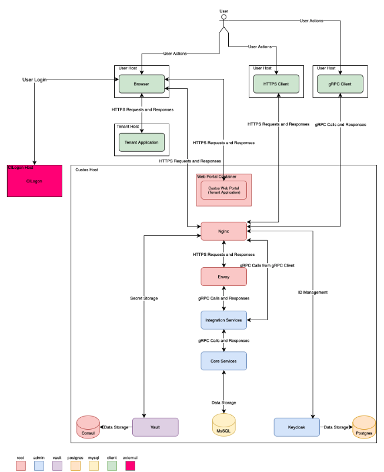

<!--
    Licensed to the Apache Software Foundation (ASF) under one
    or more contributor license agreements.  See the NOTICE file
    distributed with this work for additional information
    regarding copyright ownership.  The ASF licenses this file
    to you under the Apache License, Version 2.0 (the
    "License"); you may not use this file except in compliance
    with the License.  You may obtain a copy of the License at

      http://www.apache.org/licenses/LICENSE-2.0

    Unless required by applicable law or agreed to in writing,
    software distributed under the License is distributed on an
    "AS IS" BASIS, WITHOUT WARRANTIES OR CONDITIONS OF ANY
    KIND, either express or implied.  See the License for the
    specific language governing permissions and limitations
    under the License.
-->`

# Apache Airavata Custos Security

[](https://apache.org/licenses/LICENSE-2.0)
[](https://github.com/apache/airavata-custos/pulls?q=is%3Apr+is%3Aclosed)
[](https://travis-ci.org/github/apache/airavata-custos)

Science gateways represent potential targets for cybersecurity threats to users, scientific research, and scientific resources. Custos is a software framework that provides common security operations for science gateways, including user identity and access management, gateway tenant profile management, resource secrets management, and groups and sharing management. The goals of the Custos project are to provide these services to a wide range of science gateway frameworks, providing the community with an open-source, transparent, and reviewed code base for common security operations; and to operate trustworthy security services for the science gateway community using this software base. To accomplish these goals, we implement Custos using a scalable microservice architecture that can provide highly available, fault-tolerant operations. Custos exposes these services through a language-independent Application Programming Interface that encapsulates science gateway usage scenarios.


Following diagram illustrate the architecture of the Custos Software.




**To find out more, please check out the [Custos website](https://airavata.apache.org/custos/).**

## Quickstart

## Installation Instructions

### Setup Custos for local development

#### Prerequisites

* Java 17

* Docker installed on local environment 

* Maven 3.6.x

#### Clone the repository
```sh
git clone -b https://github.com/apache/airavata-custos.git
```

#### Start Docker Containers
Navigate to `/compose`, and start the following containers:
- Keycloack (http://localhost:8080)
- Custos DB (MySQL, http://localhost:3306)
- Vault (http://localhost:8200)
- Adminer (http://localhost:18080)

```sh
docker compose up
```

#### Configure Vault
1. Go to the Vault's exposed port (http://localhost:8200) and walk through the configuration process. 
   2. You'll need to save your initial root token and unsealed key.
3. Place your root token in `/application/src/main/resources/application.yml`, on line 50.

#### Template code for super tenant
In `/services/src/main/java/org/apache/custos/service/management/TenantManagementService.java`, add this piece of code into the class (and add all necessary imports):

```java
    @PostMapping("/initialize")
    @Hidden
    public ResponseEntity<CreateTenantResponse> initSuperTenant() {
        // TODO - add validation for exactly one execution for
        Tenant tenant = Tenant.newBuilder()
                .setClientName("Custos Super Tenant")
                .setRequesterEmail("xxxx@custos.com")
                .setAdminFirstName("CUSTOS")
                .setAdminLastName("ADMIN")
                .setAdminEmail("xxxx@custos.com")
                .setAdminUsername("custosadmin")
                .setAdminPassword("custos@887")
                .addAllContacts(List.of("xxxx@custos.com"))
                .addAllRedirectUris(List.of("http://localhost:8080/", "http://localhost:5173/callback/",
                        "http://127.0.0.1:5173/callback/", "http:///127.0.0.1:8081/swagger-ui/oauth2-redirect.html",
                        "http://localhost:3000/login/generic_oauth", "http://localhost:8000/hub/oauth_callback"))
                .setClientUri("http://localhost:8080/")
                .setScope("openid email profile cilogon")
                .setDomain("localhost")
                .setLogoUri("http://localhost:8080/")
                .setComment("Custos bootstrapping Tenant")
                .setApplicationType("web")
                .build();

        CreateTenantResponse response = tenantManagementService.createTenant(tenant);
        UpdateStatusRequest request = UpdateStatusRequest
                .newBuilder()
                .setClientId(response.getClientId())
                .setStatus(TenantStatus.ACTIVE)
                .setSuperTenant(true)
                .setUpdatedBy(Constants.SYSTEM)
                .build();
        UpdateStatusResponse updateStatusResponse = tenantManagementService.updateTenantStatus(request);
        System.out.println("Client Id :" + response.getClientId() + " Client Secret :" + response.getClientSecret());
        System.out.println(updateStatusResponse);
        return ResponseEntity.ok().build();
    }
```

After adding this piece of code, follow these instructions:
1. Install all dependencies through maven.
2. Run the CustosApplication class to bring up the backend.
3. Make a POST request to http://127.0.0.1:8081/api/v1/tenant-management/initialize (no headers, no body)
4. Grab the client id and client secret from output on the backend.

#### You're all set!
You can now make requests to Custos.


## Custos Integration With External Applications
Custos can be integrated with external applications using Custos REST Endpoints, Python SDK, or Java SDK.

### Integrate Using Java SDK
In order to perform this operation you need to have a already activated tenant in either Custos Managed Services or Your own deployment.
Following instructions are given for locally deployed custos setup which can be extended to any deployment,

####Initializing Custos Java SDK

* Add maven dependency to your project
```<dependency>
   <groupId>org.apache.custos</groupId>
   <artifactId>custos-java-sdk</artifactId>
   <version>1.1-SNAPSHOT</version>
</dependency>
```

* Initialize Custos Client Provider in your application
```
 CustosClientProvider custosClientProvider = new CustosClientProvider.Builder().setServerHost("localhost")
                    .setServerPort(7000)
                    .setClientId(CUSTOS CLIENT ID) // client Id generated from above step or any active tenant id
                    .setClientSec(CUSTOS CLIENT SECRET)  
                    .usePlainText(true) // Don't use this in production setup
                    .build();
```
Once above step is done, you can use custos available methods for  authentication and authorization purposes
* Sample client code to register and enable a User

```
 UserManagementClient userManagementClient =  custosClientProvider.getUserManagementClient();
 userManagementClient.registerUser("jhon","Smith","testpassword","smith@1",
                    "jhon@email.com",false);
 userManagementClient.enableUser("jhon");
 OperationStatus status =  userManagementClient.isUserEnabled("Jhon");
```
##### 
### Deploy Custos on remote server

Follow the Ansible based deployed instructions. see documentation [here](ansible/README.md)


### Questions or need help?
Please create a github issue or subscribe to custos mailing list ```custos-subscribe@airavata.apache.org``` and send us an email.

### Publications

```
@inproceedings{10.1145/3311790.3396635,
author = {Ranawaka, Isuru and Marru, Suresh and Graham, Juleen and Bisht, Aarushi and Basney, Jim and Fleury, Terry and Gaynor, Jeff and Wannipurage, Dimuthu and Christie, Marcus and Mahmoud, Alexandru and Afgan, Enis and Pierce, Marlon},
title = {Custos: Security Middleware for Science Gateways},
year = {2020},
isbn = {9781450366892},
publisher = {Association for Computing Machinery},
address = {New York, NY, USA},
url = {https://doi.org/10.1145/3311790.3396635},
doi = {10.1145/3311790.3396635},
booktitle = {Practice and Experience in Advanced Research Computing},
pages = {278–284},
numpages = {7},
location = {Portland, OR, USA},
series = {PEARC '20}
}
```

```
@inproceedings{10.1145/3491418.3535177,
author = {Ranawaka, Isuru and Goonasekara, Nuwan and Afgan, Enis and Basney, Jim and Marru, Suresh and Pierce, Marlon},
title = {Custos Secrets: A Service for Managing User-Provided Resource Credential Secrets for Science Gateways},
year = {2022},
isbn = {9781450391610},
publisher = {Association for Computing Machinery},
address = {New York, NY, USA},
url = {https://doi.org/10.1145/3491418.3535177},
doi = {10.1145/3491418.3535177},
booktitle = {Practice and Experience in Advanced Research Computing},
articleno = {40},
numpages = {4},
location = {Boston, MA, USA},
series = {PEARC '22}
}
```

### Acknowledgment

We are thankfull to National Science Foundation(NSF) for funding this project.

We are thankfull to  Trusted CI (https://www.trustedci.org/) for conducting the
First Principles Vulnerability Assesment(FPVA) (https://dl.acm.org/doi/10.1145/1866835.1866852) for this software and providing the above architecture diagram and security improvements. 
`
