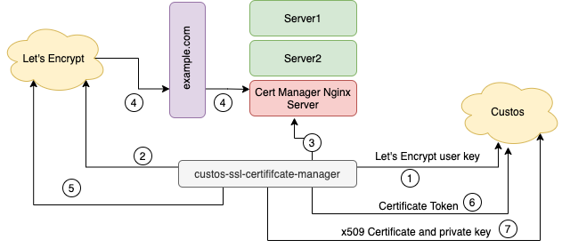

## custos-ssl-certificate-manager

A ssl certificate manager using custos and acme4j. The purpose of this application is to run as a scheduled job and 
update the ssl certificates of provided domain.

There are two sets of key pairs. One required for creating and accessing your account in Let's Encrypt, the other is 
required for encrypting the traffic on your domain. Assume these keys are user.key and domain.key. You can 
provide these as inputs or certificate manager will create keys for you. Following is a detailed explanation of the 
steps 1-7 illustrated in architecture diagram above.