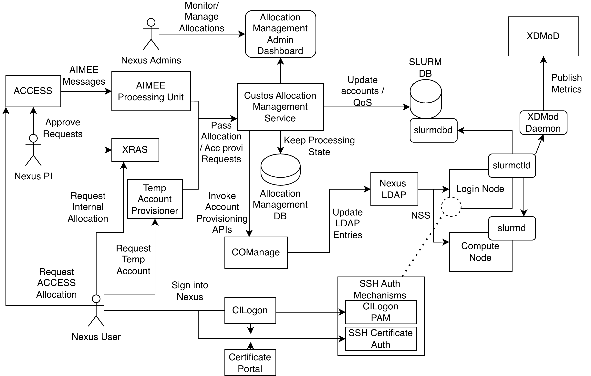

### Reference architecture for an ACCESS Resource Provider

## Allocation Sources

Typical ACCESS clusters can have 2 main allocation feeding sources:

1. **ACCESS Accounting Database (XACCT)**: ACCESS already has the proposal submission workflow. Once completed by the user and ACCESS admins, ACCESS sends resource allocation requests through AIME protocols.

2. **Resource Provider Discretion**: A dedicated eXtensible Resource Allocation Service (XRAS) is deployed for registering proposals, review, and submission to allocation management at the final stage.

## Allocation Management and Actions

Once approved, both sources feed into the Custos allocation manager, which registers events and takes necessary actions:

1. **Provision a new user account** if that user is not available on the cluster
2. **Update/create allocation entries** on SLURM allocation database

### Provisioning Reference Architecture

Provisioning requests are forwarded to CILogon Comanage to carry out the provisioning workflow. Comanage is responsible for populating preconfigured LDAP entries on the cluster's LDAP server, which tracks the cluster's Linux user accounts through NSS.

### SLURM Database Updates

SLURM database updates are discussed in [GitHub Issue #462](https://github.com/apache/airavata-custos/issues/462).

## Cluster Authentication Mechanisms

Two mechanisms are proposed for authenticating into the HPC:

### 1. CILogon PAM Extension

Users authenticate through the CILogon device authentication flow. Once authenticated, PAM validates the CILogon ID against LDAP to find the local account requested at the SSH prompt. If both match, the user is allowed to sign in. System admins can define additional filtering rules at the allocation management level to implement further access control.

### 2. SSH Certificates

SSH certificates are temporary credentials derived by a trusted root certificate in the cluster. This involves:
- An external signer service
- CILogon authentication at the service level
- Creation of delegated and scoped access credentials for the cluster

Users can hand over SSH certificates to third-party services for restricted access.

