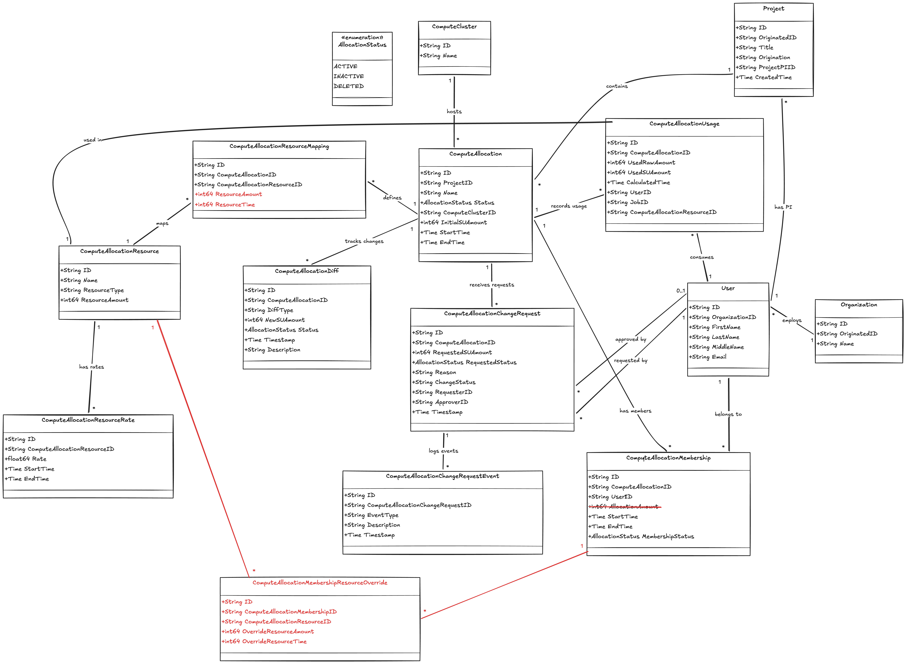

<!--
    Licensed to the Apache Software Foundation (ASF) under one
    or more contributor license agreements.  See the NOTICE file
    distributed with this work for additional information
    regarding copyright ownership.  The ASF licenses this file
    to you under the Apache License, Version 2.0 (the
    "License"); you may not use this file except in compliance
    with the License.  You may obtain a copy of the License at

      http://www.apache.org/licenses/LICENSE-2.0

    Unless required by applicable law or agreed to in writing,
    software distributed under the License is distributed on an
    "AS IS" BASIS, WITHOUT WARRANTIES OR CONDITIONS OF ANY
    KIND, either express or implied.  See the License for the
    specific language governing permissions and limitations
    under the License.
-->

# Compute Allocation Management — Data Models

## Overview

This document describes the data models that power a compute allocation management system. The system manages how projects receive, track, and consume compute resources (GPUs, CPUs, etc.) across clusters, with full auditability and fine-grained access control.

The central abstraction is the **Service Unit (SU)** — a common currency that normalizes heterogeneous resources (GPU hours, CPU hours, etc.) into a single comparable unit.

---

## Core Concepts

### Users, Organizations, and Projects

A **User** belongs to an **Organization** and is identified by name and email. Users interact with the system in two roles:

- **Project PI (Principal Investigator):** A user referenced by `Project.ProjectPIID` who owns and is responsible for a project.
- **Allocation Member:** A user added to a specific compute allocation via `ComputeAllocationMembership`, granting them permission to submit jobs against that allocation's SU budget.

A **Project** groups one or more compute allocations (and, in the future, storage allocations) under a single umbrella. Projects carry an `Origination` field indicating the source system (ACCESS, NAIRR, XRASS, etc.) and a corresponding `OriginatedID` for cross-referencing.

### Compute Clusters and Allocations

A **ComputeCluster** represents a physical or logical cluster where resources are provisioned.

A **ComputeAllocation** is the primary record linking a project to a cluster. It captures:

- The cluster where resources live (`ComputeClusterID`).
- An initial SU budget (`InitialSUAmount`) that covers all resource types within the allocation.
- A validity window (`StartTime` / `EndTime`).
- A lifecycle status (`ACTIVE`, `INACTIVE`, `DELETED`).

A single project can bundle multiple compute allocations — for example, one allocation on Cluster A with GPU resources and another on Cluster B with CPU resources.

### Resources and Rate Conversion

**ComputeAllocationResource** represents a specific type of computing unit available within a cluster — for example, "GPU B200", "GPU RTX6000", or "CPU". Each resource records its type and the quantity allocated.

Resources are linked to allocations through **ComputeAllocationResourceMapping**, which is a many-to-many join: a single allocation can include multiple resource types, and the same resource definition can appear across allocations.

**ComputeAllocationResourceRate** defines the SU conversion rate for a given resource over a time window. This is the mechanism that normalizes raw resource consumption into the common SU currency. For example:

| Resource     | Rate          | Meaning                        |
|--------------|---------------|--------------------------------|
| GPU H200     | 10.0          | 10 GPU-hours = 1 SU            |
| CPU          | 100.0         | 100 CPU-hours = 1 SU           |
| GPU RTX6000  | 20.0          | 20 GPU-hours = 1 SU            |

Rates are time-bounded (`StartTime` / `EndTime`), allowing rates to change over time without losing historical accuracy.

### Tracking Changes — Diffs and Change Requests

All modifications to a compute allocation are captured as **ComputeAllocationDiff** records, providing a complete audit trail. A diff records what changed (SU amount, status, etc.), when it changed, and why.

Diffs are created through two paths:

1. **User-initiated changes:** A user submits a **ComputeAllocationChangeRequest** (e.g., requesting additional SUs or a status change). A resource provider admin reviews the request, and upon approval, a corresponding `ComputeAllocationDiff` is generated for the target allocation. The request carries a lifecycle of its own (`PENDING` → `APPROVED` / `REJECTED`), tracked through **ComputeAllocationChangeRequestEvent** records.

2. **Automated workflows:** Systems such as ACCESS AIME can create `ComputeAllocationDiff` records directly, bypassing the change request flow. This supports programmatic adjustments like periodic SU top-ups or automatic deactivation.

### Usage Recording

**ComputeAllocationUsage** tracks resource consumption at the most granular level — per job, per user, per resource type. Each record captures both the raw amount consumed (e.g., 20 GPU-hours) and the equivalent SU cost (calculated using the effective rate at `CalculatedTime`).

Aggregating all `ComputeAllocationUsage` records for a given allocation yields the total SU consumption, which can be compared against the allocation's SU budget to determine remaining balance.

### Membership and Per-User SU Limits

**ComputeAllocationMembership** controls which users can submit jobs against an allocation. Each membership has its own validity window and status, independent of the parent allocation.

By default, members of an allocation inherit access to the full SU pool. However, administrators can enforce per-user caps by setting the `AllocationAmount` field on a membership record. This partitions a large allocation across members — for example, giving one researcher 500 SUs and another 300 SUs out of a 1,000 SU allocation — preventing any single user from exhausting the shared budget.

### Multi-Level Status Control

Allocation state can be controlled from three independent levels:

| Level            | Controlled By                                    | Effect                                              |
|------------------|--------------------------------------------------|-----------------------------------------------------|
| **Project**      | Project status / PI actions                      | Disabling a project disables all its allocations.   |
| **Allocation**   | `ComputeAllocation.Status`                       | An individual allocation can be deactivated independently. |
| **User**         | `ComputeAllocationMembership.MembershipStatus`   | A specific user's access can be revoked without affecting the allocation or other members. |

This layered approach provides flexibility: an admin can freeze an entire project, pause a single allocation, or remove one user's access — each without disturbing the other levels.

---

## Entity Relationship Summary

---

## Model Reference

| Model                                  | Purpose                                                        |
|----------------------------------------|----------------------------------------------------------------|
| `Organization`                         | Groups users under an institution.                             |
| `User`                                 | A person who can be a PI or allocation member.                 |
| `Project`                              | Bundles allocations; linked to an origination system.          |
| `ComputeCluster`                       | A cluster where resources are provisioned.                     |
| `ComputeAllocation`                    | SU budget for a project on a specific cluster.                 |
| `ComputeAllocationResource`            | A specific resource type (GPU model, CPU, etc.).               |
| `ComputeAllocationResourceMapping`     | Links resources to allocations (many-to-many).                 |
| `ComputeAllocationResourceRate`        | SU conversion rate for a resource, time-bounded.               |
| `ComputeAllocationDiff`                | Audit record of any change to an allocation.                   |
| `ComputeAllocationChangeRequest`       | User-submitted request to modify an allocation.                |
| `ComputeAllocationChangeRequestEvent`  | Lifecycle events on a change request.                          |
| `ComputeAllocationUsage`              | Per-job, per-user resource consumption record.                 |
| `ComputeAllocationMembership`          | User access to an allocation, with optional SU cap.            |