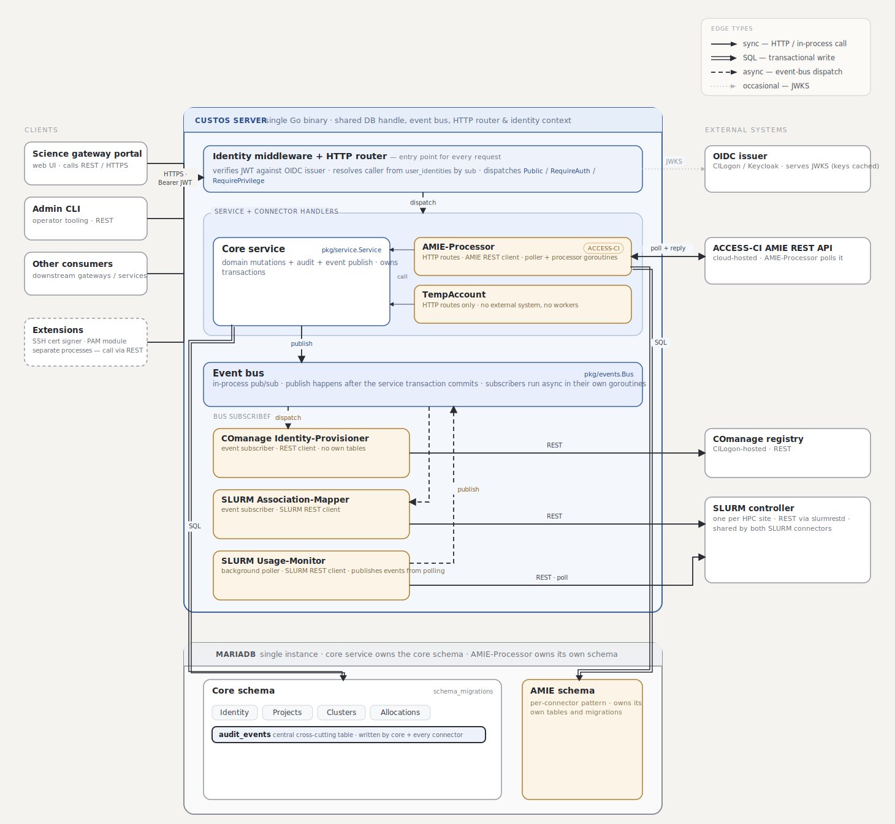

<!--
    Licensed to the Apache Software Foundation (ASF) under one
    or more contributor license agreements.  See the NOTICE file
    distributed with this work for additional information
    regarding copyright ownership.  The ASF licenses this file
    to you under the Apache License, Version 2.0 (the
    "License"); you may not use this file except in compliance
    with the License.  You may obtain a copy of the License at

      http://www.apache.org/licenses/LICENSE-2.0

    Unless required by applicable law or agreed to in writing,
    software distributed under the License is distributed on an
    "AS IS" BASIS, WITHOUT WARRANTIES OR CONDITIONS OF ANY
    KIND, either express or implied.  See the License for the
    specific language governing permissions and limitations
    under the License.
-->

# Architecture

Runtime structure and cross-cutting conventions that apply across core, connectors, and extensions. If you are writing a new connector, also read [`docs/contributing/writing-a-connector.md`](contributing/writing-a-connector.md).

## What Custos is for

Custos is identity and allocation middleware for HPC science gateways and research-computing portals. Portals call its REST API to find out who a user is, what compute allocations they belong to, which clusters they have an account on, and to drive provisioning into downstream systems (POSIX cluster accounts, SLURM associations, account-management replies to ACCESS-CI). Custos itself is the authority for the joined identity + allocation view; the external systems it integrates with are sources of truth for their own slices.

Connectors plug in the external slices: an ACCESS-CI AMIE connector pulls allocation packets from ACCESS, a COmanage connector provisions POSIX accounts into a hosted identity registry, a SLURM connector mirrors allocation membership into SLURM associations. Core stays neutral about which upstreams exist; new connectors come online by enabling a config block.

## Runtime topology

Custos is a single Go binary. `cmd/server/main.go` opens the database, runs core migrations, builds the service layer, then loads every enabled connector into the same process via `internal/connectors/loader.go`. Connectors are library packages compiled into the server. They share the server's database handle, event bus, HTTP router, and the `*service.Service` used for caller resolution and core domain calls.

**The `LoadConnector` contract.** Each connector exposes one entry point:

```go
func LoadConnector(
ctx context.Context,
database *sqlx.DB,
eventBus *events.Bus,
coreService *service.Service,
wg *sync.WaitGroup,
router *identity.Router,
connectorConfig *config.ConnectorConfig,
) error
```

The contract is enforced by the loader map in `internal/connectors/loader.go`, not by a Go interface. A connector returning an error fails server startup; the convention for "config missing, skip me silently" is to log and return `nil`.

Connectors register HTTP routes onto the shared router under `/connectors/<name>/...` (convention), subscribe to events on the shared bus, publish their own events if they need to, and may own per-connector schema in their own embedded migrations. Background workers register with the server's `sync.WaitGroup`. Shutdown is a two-phase drain: 15s for in-flight HTTP requests, then 30s for goroutines on the WaitGroup to return.

`extensions/` are a different shape: separate processes that run alongside core on HPC nodes or in their own deployment slot. `SSH-Certificate-Signer` signs short-lived SSH certificates against an OIDC-authenticated request; `CILogon-SSH-PAM` is a PAM module that lets `sshd` accept OIDC device-flow login. They share the OIDC trust boundary with core (same issuer, same audience class) but operate independently — they do not call core's REST API today. They are not loaded by `LoadConnectorsFromConfig`.

## Component diagram



Custos runs as a single Go binary; connectors share the process, database, event bus, and HTTP router.

## Request lifecycle

A typical mutating request follows the same path regardless of which connector owns the route.

1. Portal sends `POST /users` with a bearer JWT.
2. `identity.Middleware` extracts the token, verifies it against the configured OIDC issuer, resolves the caller from `user_identities` keyed by the token's `sub` claim, and attaches the caller plus their privilege set to the request context.
3. The router dispatches to the handler. For privileged routes the `RequirePrivilege` wrapper checks the privilege set on context; missing privilege returns 403.
4. The handler calls `coreService.CreateUser(ctx, user)`. The service mutates inside a transaction and stamps an audit row in the same transaction. The audit row inherits `trace_id` / `span_id` from the request context.
5. After commit, the service publishes a domain event (e.g. `events.UserCreateEvent`) on the bus.
6. Subscribers run asynchronously, each in its own goroutine. The COmanage subscriber, for example, reacts by talking to its external registry and writes its own audit row (joined to the same `trace_id`).
7. The handler returns the response to the portal.

Failures stop at the layer that detected them: an invalid token returns 401 before any handler runs; a privilege miss returns 403 before the service is touched; a service error rolls the transaction back, no audit row is written.

## Identity and authentication

Inbound auth is OIDC bearer JWT. `pkg/identity/verifier.go` validates token signature and `iss`/`aud` against `core.auth.oidc.{issuer,audience}` from `config/custos.yaml`. `pkg/identity/middleware.go` does verification once per request and puts the caller plus privileges on `ctx`.

The router exposes three modes:

- **`router.Public(pattern, handler)`** — JWT verification is bypassed for this path. Use for `/healthz`, public discovery endpoints.
- **`router.RequireAuth(pattern, handler)`** — verified caller required, no privilege check. Use for "any authenticated user can call".
- **`router.RequirePrivilege(pattern, key, handler)`** — verified caller plus the named privilege. 403 if absent.

Privilege keys live in `pkg/models/privilege.go` as a closed catalog today (`amie:read`, `amie:write`, `hpc:read`, `hpc:write`, `signer:read`, `signer:write`, `privileges:grant`, `roles:manage`). Privileges can be attached to a user directly or via roles in `roles` / `role_privileges` / `user_roles`. `coreService.EffectivePrivileges` unions the two views.

A queued cleanup will move connector-specific keys out of core into a runtime registry; the current closed catalog is transitional.

## Audit conventions

Every audit row in the system lives in the core `audit_events` table. Core, every connector, and any future extension write to it via the same shape: `id`, `event_type`, `event_time`, `entity_type`, `entity_id`, `details`, `source`, and the OpenTelemetry trace columns (`trace_id`, `span_id`, `parent_span_id`). The trace-view endpoints under `/audit/traces`, `/audit/traces/{trace_id}`, `/audit/events`, and `/audit/sources` read from this one table.

When a connector needs to attach connector-specific references to an audit row (the way AMIE keeps `packet_id` and `event_id`), those references go in a separate `<connector>_audit_extras` table the connector owns. The extras table has `audit_event_id` as its primary key with an `ON DELETE CASCADE` foreign key to `audit_events(id)`. AMIE is currently the only connector using this pattern; the shape is reusable when a future connector needs it.

The core `audit_events` table stays neutral and never grows connector-shaped columns. The unified trace view does not read extras tables; connectors that need to surface their own extras join through their own `/connectors/<name>/...` endpoints.

For the worked example (schema, store, same-transaction write), see [`docs/contributing/writing-a-connector.md`](contributing/writing-a-connector.md#10-audit-rows-and-audit_extras-if-you-have-your-own-references).

## Where to look next

- Writing a connector: [`docs/contributing/writing-a-connector.md`](contributing/writing-a-connector.md)
- Domain glossary: [`docs/glossary.md`](glossary.md)
- API reference: [`docs/API-Docs.md`](API-Docs.md)
- Allocation domain model: [`docs/Allocation-Data-Models.md`](Allocation-Data-Models.md)
- ACCESS-CI integration: [`docs/ACCESS-HPC-Reference.md`](ACCESS-HPC-Reference.md)
